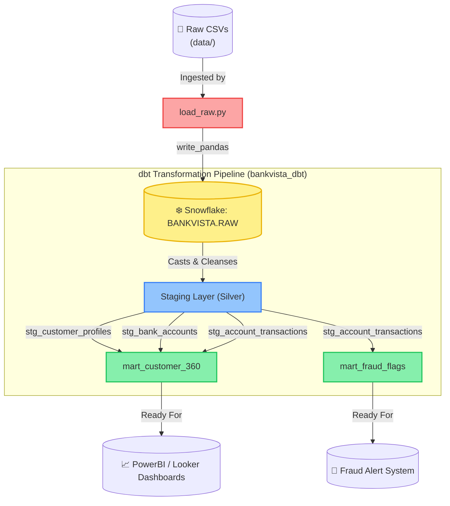

# 💳 FinTraxn Analytics Platform

Welcome to the **FinTraxn Analytics Platform**, an end-to-end, high-performance financial data engineering and warehousing platform. 

This repository implements a complete Medallion Architecture (Bronze ➔ Silver ➔ Gold) to ingest high-volume bank transaction ledgers, clean and conform client accounts, and produce analytics-ready datasets for Customer 360 BI dashboards and real-time fraud detection alerts.

---

## 🗺️ System Architecture

The platform is designed around a three-tier modern data stack integrating Python data loaders, Snowflake cloud data warehousing, and dbt transformation pipelines.



---

## 📁 Repository Structure

```directory
FinTraxn_Analytics_Platform/
├── data/                    # Dense raw financial records (CSV datasets)
│   ├── customer_profiles.csv
│   ├── bank_accounts.csv
│   └── account_transactions.csv (~300MB ledger)
├── notebook/                # Ingestion scripts
│   └── load_raw.py          # Python/Pandas bulk ingestion script for Snowflake
├── dbt/
│   └── bankvista_dbt/       # core dbt transformation project
│       ├── dbt_project.yml  # dbt configuration file
│       ├── models/          # Medallion SQL models
│       │   ├── sources.yml  # Snowflake source mappings
│       │   ├── staging/     # Silver: Cleaned & standardized views
│       │   └── marts/       # Gold: Consolidated multi-dimensional marts
│       └── README.md        # Technical specification for the dbt models
├── fintraxn/                # Python Virtual Environment
├── .env                     # Platform environment credentials (ignored from VCS)
└── README.md                # Grand platform documentation (This file)
```

---

## 🛠️ Tech Stack & Key Components

### 1. Ingestion Engine (`notebook/`)
* **[load_raw.py](notebook/load_raw.py):** A high-performance Python ingestion script that parses local CSV datasets, normalizes schema columns to standard uppercase, and performs high-speed bulk insertions into Snowflake using the `snowflake.connector.pandas_tools.write_pandas` engine with automatic table creation schemas.

### 2. Data Transformation (`dbt/bankvista_dbt/`)
* **Staging Layer (Silver):** Normalizes, type-casts, and formats raw strings into database-native timestamps and dates. Includes schema validation checks for unique values, non-null metrics, and accepted enum bounds.
* **Marts Layer (Gold):** Aggregates complex analytics matrices:
  * **[mart_customer_360](dbt/bankvista_dbt/models/marts/mart_customer_360.sql):** Integrates demographics, portfolio structures, assets, liabilities, and transactional activity history into a unified profile.
  * **[mart_fraud_flags](dbt/bankvista_dbt/models/marts/mart_fraud_flags.sql):** Computes rolling hourly transactional volumes and velocity spikes to flag suspicious card-scraping attempts (`VELOCITY_BREACH`) or high-exposure assets capital flights (`HIGH_VALUE`).

---

## 🚀 Step-by-Step Setup & Execution

Follow these steps to run the complete ingestion and transformation pipeline locally.

### Step 1: Environment Preparation
1. Create and activate a Python virtual environment:
   ```bash
   # On Windows (PowerShell)
   python -m venv fintraxn
   fintraxn\Scripts\Activate.ps1
   ```
2. Install the required platform dependencies:
   ```bash
   pip install pandas snowflake-connector-python[pandas] cryptography python-dotenv dbt-core dbt-snowflake
   ```

### Step 2: Configure Environment Variables
Create a `.env` file in the root directory of the project:
```env
SNOWFLAKE_ACCOUNT="your_account_identifier"
SNOWFLAKE_USER="your_username"
SNOWFLAKE_PASSWORD="your_password"
SNOWFLAKE_DATABASE="BANKVISTA"
SNOWFLAKE_SCHEMA="RAW"
SNOWFLAKE_WAREHOUSE="your_compute_warehouse"
SNOWFLAKE_ROLE="your_role"
```

### Step 3: Run Ingestion Engine
Execute the Python ingestion script to upload raw datasets to your Snowflake instance:
```bash
python notebook/load_raw.py
```
> [!NOTE]
> The transaction ledger (`account_transactions.csv`) contains over 300MB of dense logs. The ingestion script uses multi-threaded chunking via `write_pandas` to transfer the records securely in under a minute.

### Step 4: Run Data Transformations
Navigate into the dbt folder and run the modeling pipeline:
```bash
cd dbt/bankvista_dbt

# Install packages
dbt deps

# Verify connection to Snowflake
dbt debug

# Run all staging and marts models
dbt run

# Run quality assertion tests
dbt test
```

---

## 🧪 Data Quality & Assertions
Data quality is automatically asserted at the entry point of the transformation pipelines inside `staging.yml`. We evaluate:
- **Null Checks:** Ensuring fields like `transaction_id`, `amount`, and `customer_id` are never missing.
- **Uniqueness:** Confirming key integrity across staging tables.
- **Accepted Range Values:** Strictly enforcing business logic categories (e.g., checking that `transaction_type` is exclusively `CREDIT` or `DEBIT`).

For more details on the testing matrix and individual dbt configurations, see the internal [dbt README Guide](dbt/bankvista_dbt/README.md).