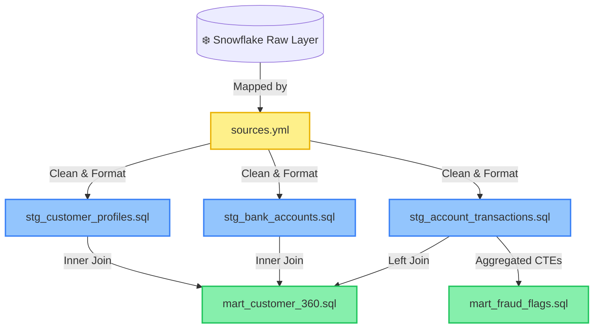

# 🏦 BankVista Analytics: dbt Transformation Pipeline

Welcome to the **BankVista Data Transformation & Modeling Engine**. This dbt (data build tool) project serves as the core analytics tier of the FinTraxn Analytics Platform, transforming raw financial data stored in Snowflake into high-fidelity, clean staging tables and consolidated analytics marts ready for BI and ML layers.

## 📌 Project Overview
* **dbt Version Compatibility:** `1.8.x`+
* **Target Warehouse:** `Snowflake`
* **Raw Database:** `BANKVISTA`
* **Raw Schema:** `RAW`
* **Analytics Architecture:** Medallion Architecture (Bronze/Silver/Gold)

---

## 🗺️ Architectural Pipeline & Data Lineage

Our data modeling architecture is organized into distinct logical zones, ensuring isolation of raw data, standardizing typing/cleansing, and producing high-value consolidated business structures.



---

## 📁 Directory Structure

```directory
bankvista_dbt/
├── dbt_project.yml          # Core project configuration
├── models/
│   ├── sources.yml          # Source definitions pointing to raw Snowflake schemas
│   ├── staging/             # Silver Layer: Data cleansing and standard schema mapping
│   │   ├── staging.yml      # Schema assertions, tests, and column constraints
│   │   ├── stg_account_transactions.sql
│   │   ├── stg_bank_accounts.sql
│   │   └── stg_customer_profiles.sql
│   └── marts/               # Gold Layer: Consolidated business and analysis models
│       ├── mart_customer_360.sql  # Customer 360-degree aggregated profile
│       └── mart_fraud_flags.sql   # Transactional velocity & risk flag engine
├── macros/                  # Custom macros for shared analytical logic
├── seeds/                   # Static lookup tables (CSV seeds)
└── tests/                   # Custom singular/generic test cases
```

---

## 🛠️ Data Modeling Layers

### 1. 🧹 Staging Layer (Silver Layer)
All models in the staging layer are materialized as **Views** to ensure cost-efficiency in Snowflake and real-time computation of schema changes.

* **[stg_customer_profiles](file:///f:/Projects/FinTraxn_Analytics_Platform/dbt/bankvista_dbt/models/staging/stg_customer_profiles.sql):** Standardizes demographics, parses ISO dates to strict `DATE` types, and evaluates customer age dynamically (`DATEDIFF('year', birth_date, CURRENT_DATE())`).
* **[stg_bank_accounts](file:///f:/Projects/FinTraxn_Analytics_Platform/dbt/bankvista_dbt/models/staging/stg_bank_accounts.sql):** Casts and standardizes monetary fields (e.g., balance and loan amounts) to standard cents precision, and ensures correct integer/float representations for terms and interest rates.
* **[stg_account_transactions](file:///f:/Projects/FinTraxn_Analytics_Platform/dbt/bankvista_dbt/models/staging/stg_account_transactions.sql):** Transforms dense string dates into microsecond-accurate Snowflake timestamps, normalizes transactional type casings, and filters out non-valid records (e.g., negative or null transaction rows).

### 2. 🍽️ Marts Layer (Gold Layer)
Marts consolidate business entities into structures optimized for dashboarding, fraud operations, and customer analytics.

* **[mart_customer_360](file:///f:/Projects/FinTraxn_Analytics_Platform/dbt/bankvista_dbt/models/marts/mart_customer_360.sql):** Combines customer demographics, complete portfolio distributions (balances, products, and loan details), and transaction history into a singular holistic customer profile. Buckets customers into decile-based `age_bands` for cohort analysis.
* **[mart_fraud_flags](file:///f:/Projects/FinTraxn_Analytics_Platform/dbt/bankvista_dbt/models/marts/mart_fraud_flags.sql):** Evaluates real-time threat landscapes by grouping hourly transaction velocities and volumes. Categorizes anomalous behavior:
  * `VELOCITY_BREACH`: Hourly transaction count > 10.
  * `HIGH_VALUE`: Hourly transaction total exposure > $50,000.

---

## 🧪 Data Quality & Schema Testing

We enforce rigorous automated testing on each model run to guarantee data integrity before consumption by downstream applications.

> [!NOTE]
> Testing thresholds are configured directly in `staging.yml` and utilize standard and nested generic test schemas.

| Model / Source Table | Column | Configured Tests | Expected Rules / Range |
| :--- | :--- | :--- | :--- |
| `stg_customer_profiles` | `customer_id` | `unique`, `not_null` | Must be a unique, non-null identifier |
| `stg_bank_accounts` | `account_id` | `unique`, `not_null` | Primary key verification |
| `stg_bank_accounts` | `account_type` | `accepted_values` | Must be strictly: `Savings`, `Loan`, or `FixedDeposit` |
| `stg_account_transactions` | `transaction_id` | `unique`, `not_null` | Primary key verification |
| `stg_account_transactions` | `amount` | `not_null` | Financial amounts must never be empty |
| `stg_account_transactions` | `transaction_type` | `accepted_values` | Must be strictly: `CREDIT` or `DEBIT` |

---

## 🚀 Quick Start Guide

### Prerequisites
1. Install Python `3.8`+
2. Install dbt Core with Snowflake adapter:
   ```bash
   pip install dbt-core dbt-snowflake
   ```

### Setup Connection Profile
Ensure you have configured your database credentials in `~/.dbt/profiles.yml`:

```yaml
bankvista_dbt:
  target: dev
  outputs:
    dev:
      type: snowflake
      account: <your_snowflake_account>
      user: <your_username>
      password: <your_password>
      role: <your_role>
      database: BANKVISTA
      warehouse: <your_warehouse>
      schema: ANALYTICS
      threads: 4
```

### Essential CLI Commands

Run these common commands inside the `dbt/bankvista_dbt/` folder:

* **Install dependencies & packages:**
  ```bash
  dbt deps
  ```
* **Verify database connection profile:**
  ```bash
  dbt debug
  ```
* **Execute all transformations:**
  ```bash
  dbt run
  ```
* **Execute tests and validate quality rules:**
  ```bash
  dbt test
  ```
* **Compile SQL and generate static documentation website:**
  ```bash
  dbt docs generate
  dbt docs serve
  ```

---

> [!TIP]
> **Pro Tip:** To run specific models along with all their parents and downstream children, use the graph operators:
> * Run just the staging models: `dbt run --select staging.*`
> * Run `mart_customer_360` and all its upstream components: `dbt run --select +mart_customer_360`
