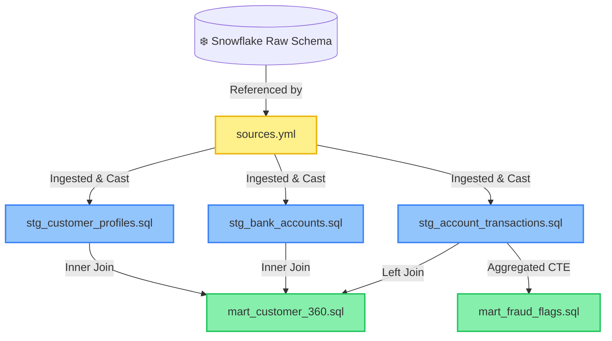

# 🏗️ BankVista Analytics: DBT Data Modeling & Architecture Guide

Welcome to the technical specifications documentation for the **BankVista Data Warehouse Models**. This document details the architectural layout, pipeline dependencies, and specific SQL operations implemented across the staging and marts layers in Snowflake.

---

## 🗺️ Architectural Pipeline

Our data modeling architecture follows the standard multi-tier design (Bronze/Silver/Gold pattern), segregating raw source ingestion from cleaned staging records and consolidated analytics marts.

---

## 🔌 Root Configuration & Sources

### 📂 [sources.yml](sources.yml)
* **Description:** Declares the raw database layer mapping to Snowflake.
* **Metadata:**
  * **Database:** `BANKVISTA`
  * **Schema:** `RAW`
  * **Ingested Tables:** `CUSTOMER_PROFILES`, `BANK_ACCOUNTS`, `ACCOUNT_TRANSACTIONS`

---

## 🧹 Staging Layer (Silver Layer)
*All models in this layer are materialized as **Views** to avoid unnecessary storage costs in Snowflake while keeping calculations dynamic.*

### 📂 [staging.yml](staging/staging.yml)
* **Purpose:** Asserts data quality constraints at the staging entry point using dbt schema tests.
* **Configured Tests:**
  * `unique` & `not_null` on primary keys: `transaction_id`, `account_id`, and `customer_id`.
  * `not_null` on transactional metrics: `amount`.
  * `accepted_values` (using modern nested `arguments` hierarchy for dbt v1.8+):
    * `transaction_type` validation: strictly `['CREDIT', 'DEBIT']`.
    * `account_type` validation: strictly `['Savings', 'Loan', 'FixedDeposit']`.

### 📄 [stg_customer_profiles.sql](staging/stg_customer_profiles.sql)
* **Purpose:** Cleans and processes raw customer demographic records.
* **SQL Transformations & Functions:**
  * `TO_DATE(birth_date)`: Standardizes ISO string birth dates into strict SQL date values.
  * `DATEDIFF('year', TO_DATE(birth_date), CURRENT_DATE())`: Evaluates customer age dynamically using current system timestamp.
* **Schema Schema Map:**
  * `CUSTOMER_ID` ➡️ `customer_id`
  * `NATIONAL_ID` ➡️ `national_id`
  * `CITY` ➡️ `city`
  * `STATE` ➡️ `state`

### 📄 [stg_bank_accounts.sql](staging/stg_bank_accounts.sql)
* **Purpose:** Cleans account dimension data and standardizes monetary values.
* **SQL Transformations & Functions:**
  * `TO_DATE(creation_date)`: Standardizes timestamp values to date fields.
  * `ROUND(balance::FLOAT, 2)`: Casts numeric balance fields to double-precision floats and rounds to two decimal places.
  * `ROUND(loan_amount::FLOAT, 2)`: Casts and rounds loan balances to standard monetary cents precision.
  * `TERM_MONTHS::INT`: Casts loan terms to integers.
  * `INTEREST_RATE::FLOAT`: Casts interest percentages to float values.

### 📄 [stg_account_transactions.sql](staging/stg_account_transactions.sql)
* **Purpose:** Cleans, standardizes, and filters the dense transactional ledger.
* **SQL Transformations & Functions:**
  * `TO_TIMESTAMP(created_time)`: Transforms string dates into microsecond-accurate Snowflake timestamps.
  * `UPPER(transaction_type)`: Force-normalizes transaction directions (e.g., `'debit'` to `'DEBIT'`).
  * `ROUND(amount::FLOAT, 2)`: Ensures currency precision standards are met.
* **Row-Level Filters:**
  * `WHERE AMOUNT > 0`: Excludes empty or negative adjustment entries.
  * `AND TRANSACTION_ID IS NOT NULL`: Enforces referential integrity at the engine level.

---

## 🍽️ Marts Layer (Gold / Analytics Layer)
*Consolidated analytics models optimized for reporting, business intelligence, and security operations.*

### 📄 [mart_customer_360.sql](marts/mart_customer_360.sql)
* **Purpose:** Aggregates a multi-dimensional customer-centric view, combining demographics, account portfolio metrics, and active transaction activity.
* **SQL Transformations & Analytical Functions:**
  * **Demographic Segmentation:** `FLOOR(cp.age / 10) * 10 AS age_band` buckets customer ages into decile-based bands (e.g., 20s, 30s) for simplified cohort grouping.
  * **Portfolio Metrics:**
    * `COUNT(DISTINCT ba.account_id) AS total_accounts`: Calculates unique account holdings.
    * `COUNT(DISTINCT ba.account_type) AS product_count`: Summarizes distinct bank product penetration per customer.
    * `SUM(ba.balance) AS total_balance`: Aggregates active deposit assets.
    * `SUM(ba.loan_amount) AS total_loan`: Aggregates active liabilities.
    * `MAX(CASE WHEN ba.account_status = 'Inactive' THEN 1 ELSE 0 END) AS has_inactive_account`: Boolean flag evaluated via maximum case condition to mark multi-account customers with dormant products.
  * **Activity Metrics:**
    * `COUNT(tx.transaction_id) AS lifetime_tx_count`: Sums overall card use history.
    * `SUM(CASE WHEN tx.transaction_type='Debit' THEN tx.amount ELSE 0 END) AS total_spend`: Extracts debit card expenses using conditional summation.
    * `MAX(tx.created_at) AS last_transaction_date`: Tracks customer transaction recency.
* **Relational Joins:**
  * `stg_customer_profiles cp` **INNER JOIN** `stg_bank_accounts ba` on `customer_id` (assures account records are mapped to verified profiles).
  * **LEFT JOIN** `stg_account_transactions tx` on `account_id` (safeguards profile aggregation from drop-offs if a customer has zero transactional history).
* **Dimensional Grouping:** `GROUP BY 1,2,3,4,5` (resolves grouping constraints across the unaggregated demographic dimensions).

### 📄 [mart_fraud_flags.sql](marts/mart_fraud_flags.sql)
* **Purpose:** Identifies anomalous spikes in volume or value in real-time grouped transaction cohorts.
* **SQL Pipeline Patterns:**
  * **CTE Pattern (`hourly`):** Groups events at the individual hour granularity to capture high-velocity anomalies.
    * `DATE_TRUNC('hour', created_at) AS tx_hour`: Groups precise timestamps into strict one-hour buckets.
    * `COUNT(*) AS tx_count`: Counts hourly volume.
    * `SUM(amount) AS hour_total`: Aggregates financial exposure per window.
  * **Conditional Risk Classification:** Evaluates risk vectors using search-case conditions:
    * `WHEN tx_count > 10 THEN 'VELOCITY_BREACH'`: Triggers alarm for card-scraping behavior.
    * `WHEN hour_total > 50000 THEN 'HIGH_VALUE'`: Flags suspicious high-exposure capital movement.
    * `ELSE 'NORMAL'`: Categorizes baseline behavior.
* **Target Filters:**
  * `WHERE tx_count > 10 OR hour_total > 50000` inside the final SELECT. This isolates threat surfaces so fraud analysts do not run queries on standard transactional traffic.
